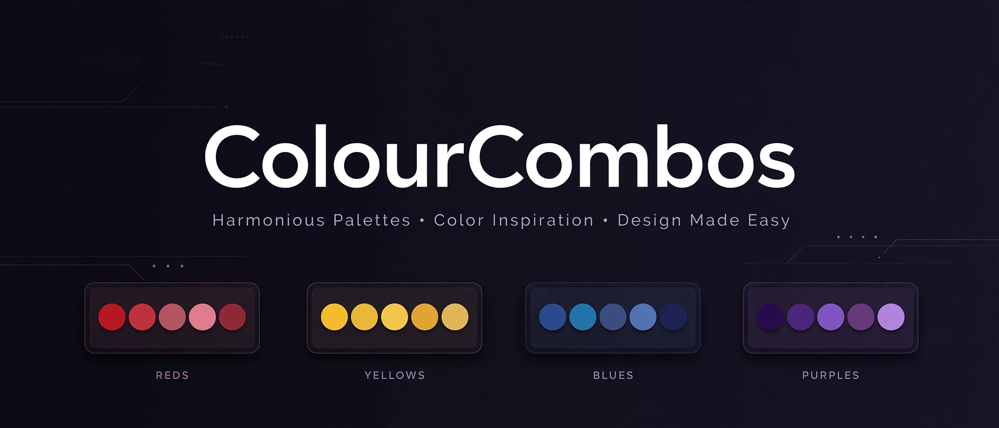

# ColourCombos

> ## Status: 🟢 Completed
>
> <progress value="95" max="100"></progress>
> **Progress: 95%** — 3 palettes inventoried in `combos.json` with 16 font files in place; minor gap: Source Serif 4 is listed in `fonts.json` but missing from `fonts/fonts.css`.

<p align="center">
  
</p>

[](combos.json)
[](fonts.json)

## What it is

A palette-and-font library extracted from the user's reference posters — the
design assets for a webpage to be built later. Three color combos are sampled
directly from poster swatch blocks and kept **in the order they appear in each
image** (top to bottom). A categorized font collection (display / readable /
mono) is bundled with self-hosted `@font-face` rules.

## What works (verified)

- ✅ **`combos.json` is complete and consistent** (verified by reading) — 3 palettes: Fresh Lemons (`#25366c` → `#d21c2c` → `#feefa1`), Bloom (`#e7cfa4` → `#371540` → `#db6427`), Autumn Vibes (`#973d39` → `#f2dfc3` → `#ec963e`). Every hex matches its RGB triplet; each color carries a name, transcribed Pantone label, role in the poster, and the source poster.
- ✅ **16 font files on disk** (verified with `find`) — Display: ZT Bros Oskon 90s (6 OTFs: Extra Light/Light/Regular + italics), JaneAusten (TTF), Palmore (TTF); Readable: Inter variable (wght 100–900 + italic), Source Serif 4 variable (wght 200–900 + italic); Mono: Space Mono (4 TTFs).
- ✅ **`fonts.json` inventory covers all families** (verified by reading) — categories, css family names, weights, styles, variable ranges, and license notes all present.
- ✅ **`fonts/fonts.css` serves 14/16 files** (verified by grep) — every file except the two Source Serif 4 TTFs has a working `@font-face` block with `font-display: swap`.
- ⚠️ **No CI** — `gh run list` shows no workflows/runs; this is a static asset repo, so there is nothing to build. No tests exist.

### License caveats (from `fonts.json`, worth heeding)

- **JaneAusten** — free for *personal use only* (Pia Frauss, 2005). Its readme is kept in `fonts/display/JaneAusten/` per the distribution terms. Not for commercial use without permission.
- **ZT Bros Oskon 90s / Palmore** — user-provided; verify the license before publishing anything public.

## Tech stack

| Area   | Choice |
|--------|--------|
| Data   | Plain JSON (`combos.json`, `fonts.json`) |
| Fonts  | Self-hosted OTF/TTF, variable fonts (Inter, Source Serif 4) via `fonts/fonts.css` |
| Style  | None (asset library — no build step) |
| CI     | None |

## How to run

No build or install step — these are static assets. To preview the fonts
locally:

```sh
cd ~/workspace/checked/ColourCombos
python3 -m http.server 8000
# then open http://localhost:8000/ and view README-rendered palettes
# or drop into a page: <link rel="stylesheet" href="fonts/fonts.css">
```

Import the palettes into a webpage:

```js
// with a bundler
import combos from './combos.json';
// or fetch('./combos.json').then(r => r.json())
```

## Palettes

| Combo | Colors (top → bottom) |
|-------|------------------------|
| **Fresh Lemons** | `#25366c` Deep Blue → `#d21c2c` Lemon Red → `#feefa1` Pale Yellow |
| **Bloom** | `#e7cfa4` Warm Tan → `#371540` Deep Plum → `#db6427` Burnt Orange |
| **Autumn Vibes** | `#973d39` Autumn Maroon → `#f2dfc3` Oat Beige → `#ec963e` Harvest Orange |

Suggested pairing: **ZT Bros Oskon 90s** headlines, **Inter** body, **Space Mono** hex codes and labels, **JaneAusten** / **Palmore** as script accents.

> Hex values are image-sampled screen approximations, not official Pantone values.

## Screenshots

No screenshots — the banner above is the visual. The palettes render as plain
hex swatches (see table above).

## What you can add more

- [ ] **Add Source Serif 4 to `fonts/fonts.css`** — the two TTFs are committed but have no `@font-face` blocks, so linking the CSS won't load them.
- [ ] **Build the planned webpage** — this repo exists to feed a poster-style page; wire `combos.json` + `fonts.css` into a gallery of the three combos.
- [ ] **License confirmation** — verify ZT Bros Oskon 90s and Palmore are clear for public/web use before the page goes live; swap JaneAusten for a commercial-safe script if the page is commercial.
- [ ] **Palette demo HTML** — a single `demo.html` rendering all combos as swatches with copy-on-click hex codes (Space Mono, naturally).

## Project structure

```
.
├── combos.json     # Source of truth: 3 palettes with hex, rgb, Pantone label, role, order
├── fonts.json      # Categorized font inventory: display / readable / mono + licenses
└── fonts/
    ├── fonts.css           # Self-hosted @font-face bundle (14/16 files)
    ├── display/
    │   ├── ZTBrosOskon90s/ # 6 OTFs (Extra Light/Light/Regular + italics)
    │   ├── JaneAusten/     # TTF + readme (personal use only)
    │   └── Palmore/        # TTF (retro rounded script)
    ├── readable/
    │   ├── Inter/          # variable TTFs, wght 100–900 + italic (OFL)
    │   └── SourceSerif4/   # variable TTFs, wght 200–900 + italic (OFL) — not yet in fonts.css
    └── mono/
        └── SpaceMono/      # 4 TTFs: Regular/Bold + italics (OFL)
```

---
*README written after code audit on 2026-10-08.*
